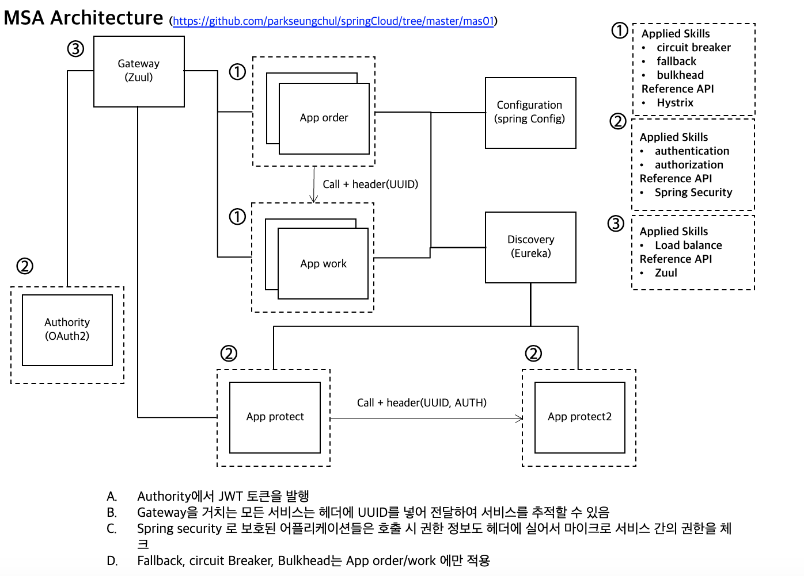

# springCloud with springboot

## halibut version.1

- SpringBoot 기반의 DevOps 

- 광어(halibut)처럼 바닥에 붙어 어플리케이션 개발 서포트가 주 목적 

## halibat list

- [mas01](https://github.com/parkseungchul/springCloud/tree/master/mas01)
  - spring config
  - eureka 
  - Hystrix feign, fallback
  - zuul
  - OAuth2
  - https://hyu-my.sharepoint.com/:p:/g/personal/pol1501_hanyang_ac_kr/EXDGqFtZed1PnB2dYLC-QogBCfn2V8UADxlIUxKX0bvDRg?e=49cyAR
  - 
  
- [mas01A](https://github.com/parkseungchul/springCloud/tree/master/mas01A)
  - 마이크로서비스 업무 구현 (mas01 고도화)